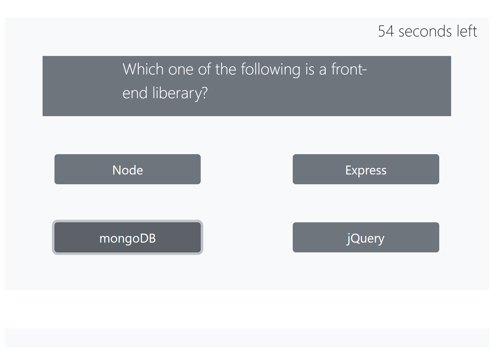
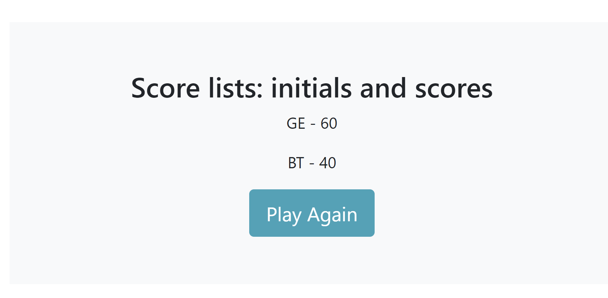

# Code_Quiz
* View the [GitHub-repo](https://github.com/girmaD/Code_Quiz)
* View the [depolyed application](https://girmad.github.io/Code_Quiz/)
___
## Table Of Contents
* [Introduction](#Introduction)
* [Objective](#Objective)
* [Snap shot of the UI](#snap-shot-of-the-UI)
* [How To Use The App](#How-To-Use-The-App)
* [Contact](Contact)
## Introduction
This application is a code quiz made using HTML, Bootstrap and vanila javaScript. It runs on the browser. And it features a dynamically updated HTML and Bootstrap made possible by the awesome power of JavaScript. The questions are code related and are timed. Getting the correct answer for each question will get you a score of 10 and incorrect/incorrect will be displayed each time you clicked on your answer. Correct is displayed in green and incorrect is displayed in red.

When you finish the questions or when the time is up - you will be led to a different page - that takes your initials as input and that displays your score. When you submit your initials - you score lists will be populated.

## Objective
THe objective is build a timed coding quiz with multiple-choice questions. This app will run in the browser, and will feature dynamically updated HTML and CSS powered by JavaScript code. It has a clean, polished, and responsive user interface.

## Snap shot of the UI

## How To Use The App

1. Click **Start Quiz** button
2. You will be displayed with a multiple choice question. And also the time will start counting down.

3. You will then have the option to click on the answer. When you click your answer - the app tells you whether your answer is *corrct* or *incorrect*. If your answer is incorrect the time will be cut by additional 20 seconds.
4. When either the countdown is over or when you are done with the questions - new page that shows your score and that takes your initials as input will be displayed.

5. Enter your initials on the text input and click enter.
6. Your intials and score will be populated on a new page. This pay also contains a button that gives you the chance to play agian. If you would like to *play again*, click play again button, the game will start all over again

## Technologies Used

- Bootstrap
- JavaScript
- CSS
- HTML

## License
- MIT

## Contact

Should you have any questions about this repo or the deployed page, contact me on [girma.derib@gmail.com](mailto:girma.derib@gmail.com)
